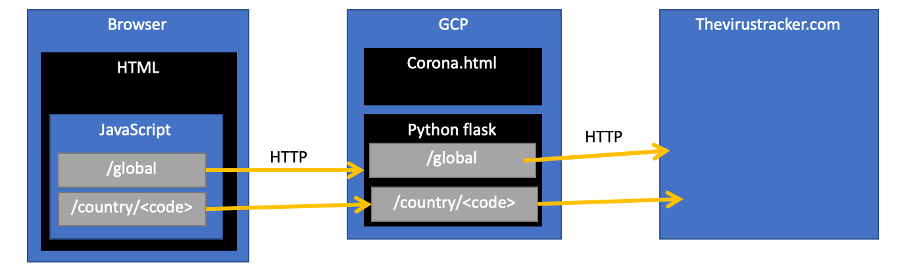
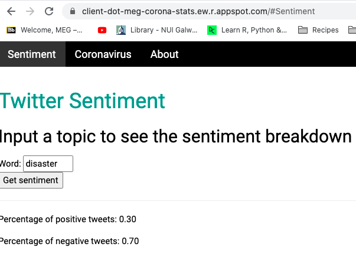
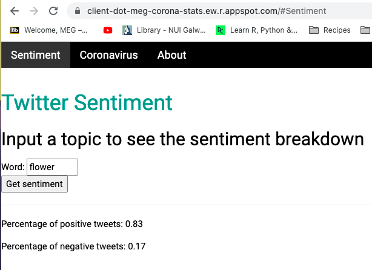

## Introduction

* I created this project to learn Javascrip, HTML, HTTP and GCP while also providing some useful, up-to-date COVID 19 stats.
* Here's a high level picture of what the architecture looks like. 

There are 7 main files in this projectl, corona.html, main.py, server.yaml, app.yaml, client.yaml, cloudbuild.yaml, nltk_data.py and requirements.txt. The corona.html is a HTML file. It's a single page web app. A single page web app is a web app that interacts with the browser by dynamically rewriting the page with new data from the web server, instead of the browser loading entirely new pages. The files deployed on GCP, this means that anyone can make a HTTP get request to access the web app from their browser. A http get request is used to request data from a specified source. The file also contains JavaScript. When triggered through user interaction this JavaScript will make a HTTP get request to the python flask app in order to get retrieve data from other sources on the internet. Asynchronous HHTP requests are used. This means you receive a call-back when the payload of the request has been received. This stops the browser from freezing when the request is being handled. The reason it has to make the request to the flask app instead of directly to wherever the data is from is because of CORS. CORS is a mechanism that restricts access to resources outside of a given domain, in this case it means that your browser cannot make get requests to anything but the files hosted on GCP. Therefore, is has to make a request to the flask app and then the flask app makes the HTTP request for the actual data. Once it receives the payload of this request it will then display this data in the browser.  

The mian.py file is where the python flask app is. Flask is a lightweight Python framework for web applications that provides the basics for URL routing and page rendering. The flask app makes the HTTP get requests for the data. Once the data is received its manipulated, for example in the case of the twitter data the raw tweet text is extracted and sentiment analysis is performed. It then returns this back to the corona.html file. 

The YAML files are configuration files that are necessary for configuring the GCP deployment When you deploy files to GCP they are hosted in the cloud. This means that the HTML file can be accessed via a browser. The server.yaml file configures the flask webserver with associated URLs. It also makes the NLTK corpora available to the flask server.The requirements.txt makes available the python libraries needed to the server.
  The client.yaml configures the files that are needed on the client side, such as fonts, images and CSS for the browser. 

I implemented parts of the continuous integration continuous deployment process by setting up a GCP mirror of my git hub repo. I also had to configure a cloudbuild.yaml file to instruct GCP on the steps required for deployment. This all means that when a change is committed to git hun it is automatically deployed in GCP as well. 

## Screenshots

* Here are some examples of the web app running. 

* Below are project details, resources and tutorials that I've used. 

## COVID 19 stats 
* [Postman COVID-19 API Resource Center](https://covid-19-apis.postman.com/)  
* [API used in project to get country COVID stats](https://documenter.getpostman.com/view/8854915/SzS7R74n?version=latest)
* [API used in project to get global COVID stats](https://documenter.getpostman.com/view/11144369/Szf6Z9B3?version=latest)

## JavaScript
* [JavaScript library to select country and region](https://github.com/benkeen/country-region-selector) 
* [How to do single page web app in JavaScript](https://itnext.io/build-a-single-page-web-app-javascript-and-the-dom-90c99b08f8a9)

## Flask
* [Flask tutorial](https://www.digitalocean.com/community/tutorials/how-to-make-a-web-application-using-flask-in-python-3)
* how to run flask on localhost: 
 * export FLASK_APP=corona_stats
 * export FLASK_ENV=development
 * flask run

## GCP 
* [good tutorial about GCP](https://medium.com/@dmahugh_70618/deploying-a-flask-app-to-google-app-engine-faa883b5ffab)

## My GCP Project 
* Project name: meg-corona-stats
* [Project deployment](https://client-dot-meg-corona-stats.ew.r.appspot.com)
* [Link to project](https://console.cloud.google.com/home/dashboard?q=search&referrer=search&project=meg-corona-stats&folder=&organizationId=)
 * [deployment logs](https://console.cloud.google.com/logs/)
 * [GCP trigger to deploy on Git push](https://console.cloud.google.com/cloud-build/triggers?project=meg-corona-stats&folder&organizationId)
 * [mirrored GCP repo](https://source.cloud.google.com/meg-corona-stats/github_megregan_covid-stats)
 * [buids](https://console.cloud.google.com/cloud-build/builds?project=meg-corona-stats)
 * [GCP app engine](https://console.cloud.google.com/appengine?project=meg-corona-stats&serviceId=default)
* how to deploy at command line (no longer needed as git trigger used in deployment): 
 * gcloud app deploy app.yaml server.yaml client.yaml
 * gcloud app browse

## Git push related commands
* git clone https://github.com/megregan/covid-stats.git
* git add . 
* git commit -m "initial version" 
* git push

# HTML
* [HTML template used in project](https://www.w3schools.com/w3css/tryit.asp?filename=tryw3css_templates_webpage&stacked=h)
* [Other HTML templates](https://www.w3schools.com/w3css/w3css_templates.asp)

